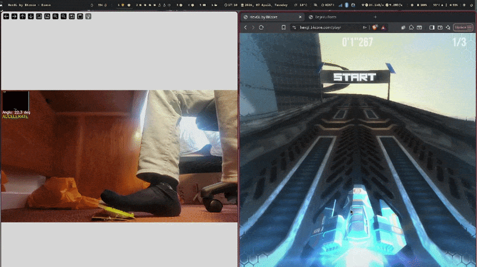

# Cardboard pedal for racing games with using openCV


This small project detects a colored object in real-time using OpenCV,
Then calculates and visualizes its orientation angle.
it draws:
- the detected contour
- a bounding box
- the direction vector
- the angle relative to horizontal

based on the angle, using ydotool, it "presses" arrow keys hence : accelerating, braking, ideling. 

here is a demo video :




To run it (on linux, wayland):
First install ydotool.
then :
 ```
pip install -r requirements.txt
python pedal.py
```
I tried this with https://hexgl.bkcore.com/. 
Also install ydotool.
